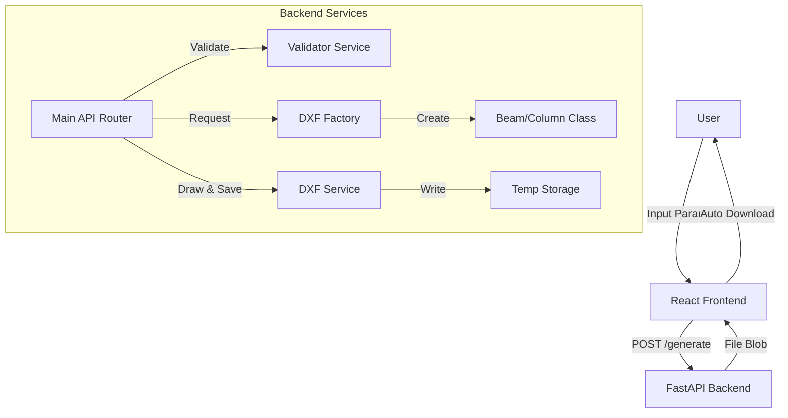

# DXF Generator - System Design Document

## 1. System Overview
The **DXF Generator** is a web-based application that creates AutoCAD-compatible DXF files for structural engineering components (I-Beams and Columns). It features a modern React frontend and a robust Python FastAPI backend, supporting both single-item and batch generation modes.

## 2. Architecture Diagram

## 3. Core Components

### 3.1 Frontend (`frontend/src/App.jsx`)
- **Technology:** React, Vite.
- **Data Source:** `frontend/src/templates.json` (Stores standard beam/column configurations).
- **Responsibilities:**
    - **State Management:** Handles component type (`beam`/`column`), parameters (`H`, `B`, `tw`, `tf`), and batch lists.
    - **Validation:** Prevents invalid inputs (negative values) before sending requests.
    - **Sequential Processing:** Implements a "Pause & Play" loop for batch downloads to bypass browser popup blockers.
    - **UX Features:** Auto-clearing inputs, range hints, and **auto-hiding error messages (6s timeout)**.

### 3.2 Backend (`backend/main.py`)
- **Technology:** Python, FastAPI.
- **Responsibilities:**
    - **API Endpoint:** `POST /generate` accepts JSON configuration.
    - **Concurrency:** **Lockless execution** allowing parallel processing of requests for high scalability.
    - **File Management:** Generates unique UUID filenames and uses **BackgroundTasks** to auto-delete files immediately after serving.

### 3.3 Services & Interfaces
- **Validator (`interfaces/validator.py`):** Centralized logic for checking physical constraints (e.g., Flange Thickness < 100mm).
- **Interface (`interfaces/dxf_generator_interface.py`):** Implements the **Factory Pattern** to dynamically instantiate the correct class (`IBeam` or `Column`) based on user input.
- **DXF Service (`services/dxf_service.py`):** Encapsulates the `ezdxf` library calls to draw entities and save files.

## 4. Key Design Decisions

### 4.1 Sequential Batch Downloading
**Problem:** Browsers often block 50+ simultaneous file downloads as spam.
**Solution:** The frontend loop triggers one download, waits 500ms, and then triggers the next. This ensures 100% delivery reliability.

### 4.2 Scalable Concurrency & Cleanup
**Problem:** Serializing requests with a global lock created a bottleneck for multiple users, and temporary files risked filling disk space.
**Solution:** 
1. **Concurrency:** The global lock was removed to allow `ezdxf` to process requests in parallel (thread-safe for independent documents).
2. **Auto-Cleanup:** FastAPI `BackgroundTasks` are used to delete the generated DXF file immediately after it is served to the client, ensuring zero disk accumulation.

### 4.3 Validation Strategy
**Problem:** Users could crash the server with input like `tf=150` (Physical MAX is 100).
**Solution:**
1.  **Frontend:** Placeholders show ranges (e.g., `50-2000`).
2.  **Backend:** `Validator` class enforces `min=1` (to prevent zero-dimension errors) and maximum physical limits.
3.  **Exception Handling:** The API specifically catches 400-level validation errors to return helpful messages instead of generic 500 crashes.

## 5. Security & Safety
- **Authentication:** Standard `Login.jsx` implemented with hardcoded validation (`user`/`user`) for simple access control.
- **Inputs:** All numeric inputs are validated for type and range.
- **Files:** Generated in the system's temporary directory (`tempfile.gettempdir()`) with random UUIDs to prevent file overwrites or path traversal attacks.
